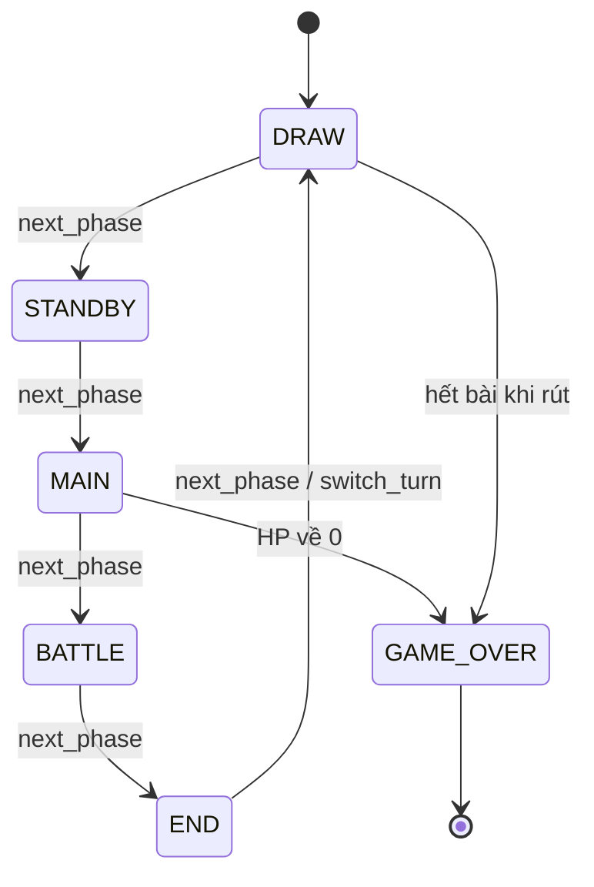
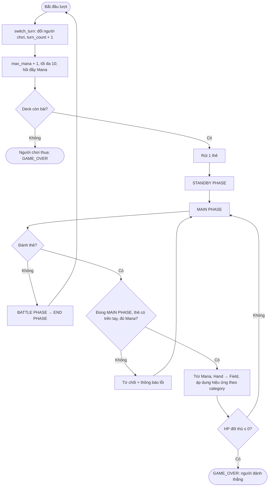
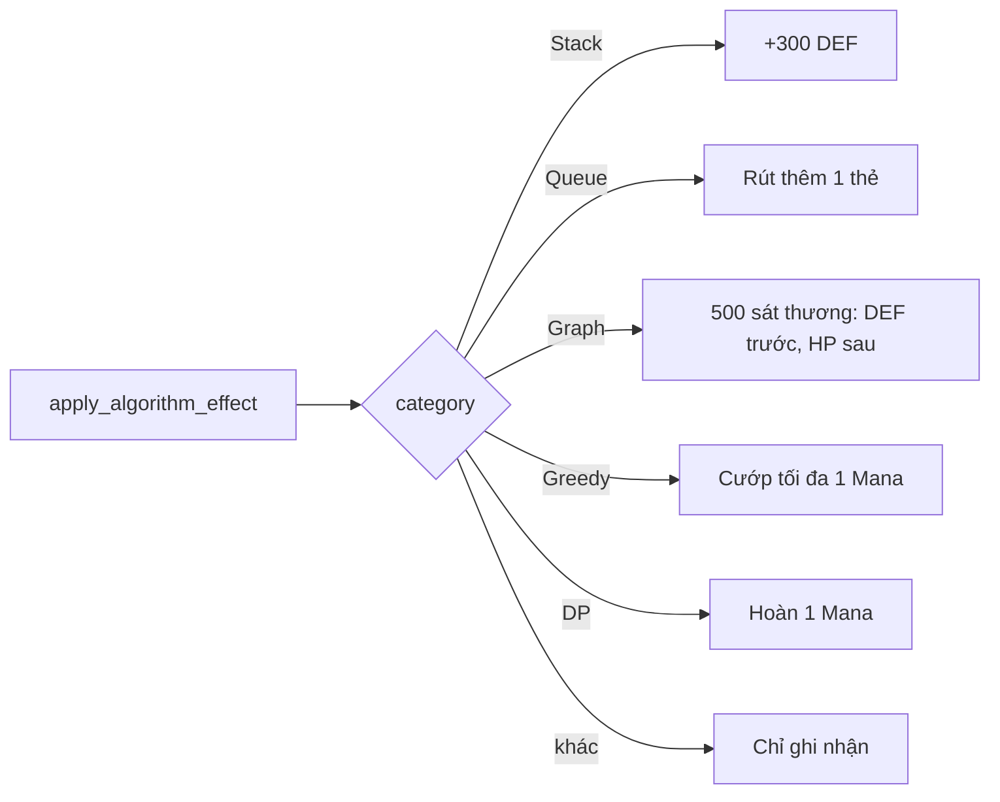

# Task 3 – Sơ đồ rule engine

## 1. Sơ đồ trạng thái trận (dán vào mermaid.live hoặc draw.io → Arrange → Insert → Advanced → Mermaid)

```mermaid
stateDiagram-v2
    [*] --> DRAW
    DRAW --> STANDBY: next_phase
    STANDBY --> MAIN: next_phase
    MAIN --> BATTLE: next_phase
    BATTLE --> END: next_phase
    END --> DRAW: next_phase / switch_turn
    MAIN --> GAME_OVER: HP về 0
    DRAW --> GAME_OVER: hết bài khi rút
    GAME_OVER --> [*]
```

## 2. Lưu đồ xử lý một lượt

```mermaid
flowchart TD
    A([Bắt đầu lượt]) --> B[switch_turn: đổi người chơi, turn_count + 1]
    B --> C[max_mana + 1, tối đa 10; hồi đầy Mana]
    C --> D{Deck còn bài?}
    D -- Không --> L([Người chơi thua: GAME_OVER])
    D -- Có --> E[Rút 1 thẻ]
    E --> F[STANDBY PHASE]
    F --> G[MAIN PHASE]
    G --> H{Đánh thẻ?}
    H -- Không --> M[BATTLE PHASE → END PHASE]
    H -- Có --> I{Đúng MAIN PHASE, thẻ có trên tay, đủ Mana?}
    I -- Không --> J[Từ chối + thông báo lỗi] --> G
    I -- Có --> K[Trừ Mana, Hand → Field, áp dụng hiệu ứng theo category]
    K --> N{HP đối thủ ≤ 0?}
    N -- Có --> O([GAME_OVER: người đánh thắng])
    N -- Không --> G
    M --> A
```

## 3. Áp dụng hiệu ứng thẻ

```mermaid
flowchart LR
    P[apply_algorithm_effect] --> S{category}
    S -- Stack --> S1[+300 DEF]
    S -- Queue --> S2[Rút thêm 1 thẻ]
    S -- Graph --> S3[500 sát thương: DEF trước, HP sau]
    S -- Greedy --> S4[Cướp tối đa 1 Mana]
    S -- DP --> S5[Hoàn 1 Mana]
    S -- khác --> S6[Chỉ ghi nhận]
```
